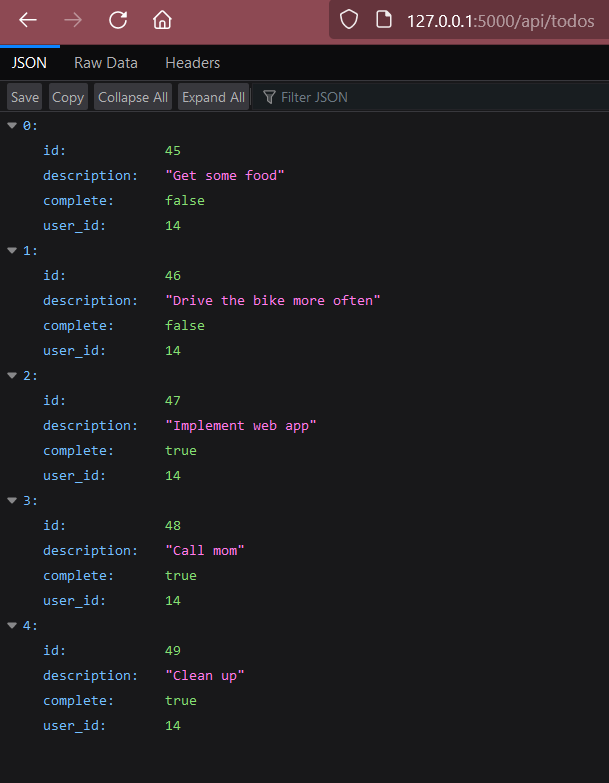
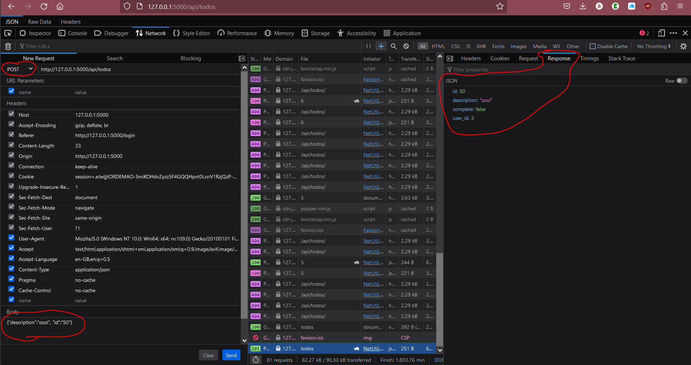
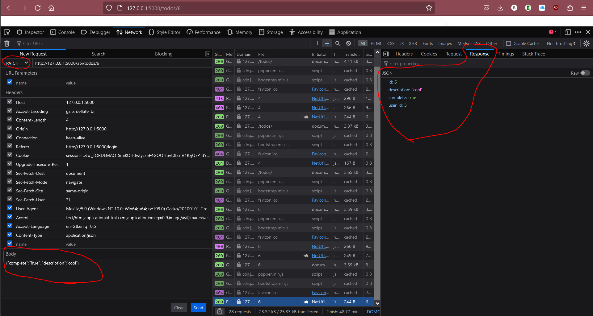

Finn Höhne
{: .label }

# API reference
{: .no_toc }

  

    Table of contents
  

  {: .text-delta }
- TOC
{:toc}

## GET

### `def get(self, id=None)`

**Route:** `/api/todos`, or `/api/todos/<int:id>` The function contains a if condition that checks whether an id is given in the url or not.

**Methods:** `GET`

**Purpose:** The function gives all todos if no id was provided in the url and one specific todo if one was provided return that todo in json

**Sample output:**

Output for `/api/todos`:

Output for `/api/todos/<int:id>`:

---

## POST

### `def post(self)`

**Route:** `/api/todos`

**Methods:** `POST`

**Purpose:** The function creates a new todo for the user.

**Sample output:**

Via login it does not work with normal http-requests, because login goes via a form. Dev-tools f12:
 
In the upper left-hand corner, I've placed the post, and at the bottom left-hand corner, I've inputted the data. In the upper right-hand side, you can observe the output.

---

## PATCH

### `def patch(self, id):`

**Route:** `/api/todos/<int:id>`

**Methods:** `PATCH`

**Purpose:** The function changes the todo item with the given id of the user.

**Sample output:**

Via login it does not work with normal http-requests, because login goes via a form. Dev-tools f12:

In the upper left-hand corner, I've placed the patch, and at the bottom left-hand corner, I've inputted the data. In the upper right-hand side, you can observe the output.

---

## DELETE

### `def delete(self, id)`

**Route:** `/api/todos/<int:id>`

**Methods:** `DELETE`

**Purpose:** The function deletes the todo item with the given id of the user.

**Sample output:**

None

---