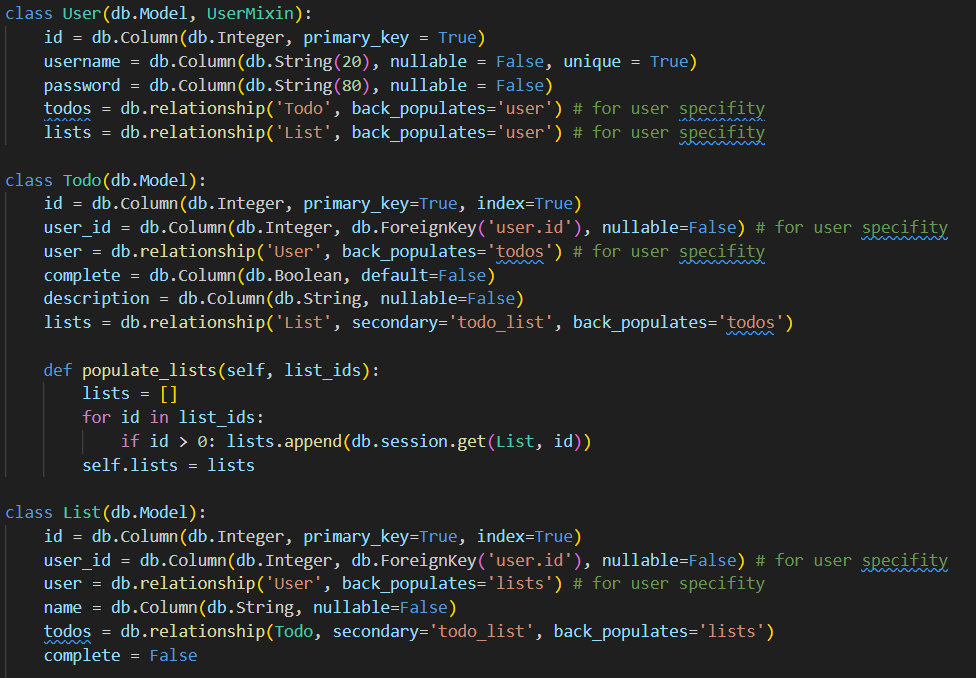
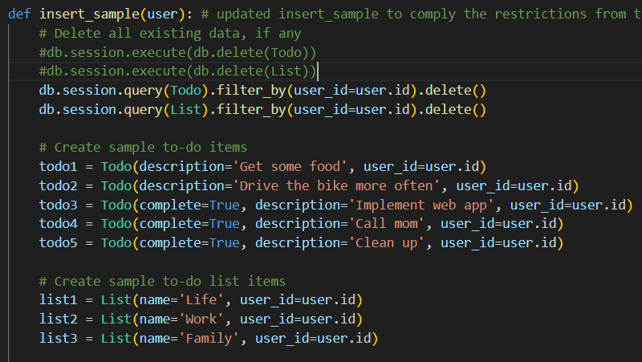

Finn Höhne
{: .label }

# Data model
{: .no_toc }

  

    Table of contents
  

  {: .text-delta }
- TOC
{:toc}

## Data model changes compared to the baseline

In comparison to the baseline I have added/changed the following:

I added a User class to represent user data. It comprises all the necessary data to handle different users.

It includes fields such as id, username, and password.The UserMixin class from Flask-Login is used to provide common user-related functionality. I also created a relationship between the User model and the Todo and List models, allowing each user to have their specific tasks and lists. Furthermore, now a user-specific foreign key (user_id) is added to the Todo and List models to ensure that tasks and lists are associated with a specific user. I also established User-specific relationships between the User model and the Todo and List models using the db.relationship function.

I updated insert_sample function to ensure that sample data is associated with a specific user. If wouldn't have changed this function it would not work because of the the user_id in List and Todo. Both have a not Null constraint. Moreover, it now only deletes data associated with the current user before creating new sample data so that one user doesn't have access to delete data from all accounts.

In this excerpt one can see how (in comments) how before just all the data from Todo and List was deleted (line 3 and 4). Now (line 5 and 6) only the data from Todo and List is deleted that has the same user_id as the the current user's id. Additionally, one can see that every element that is added to the database gets the id from the current user as user_id. 
    
    
Overall, now the data model includes user authentication, user-specific data management, and user-specific data association. This allows each user to have their tasks and lists in the application.